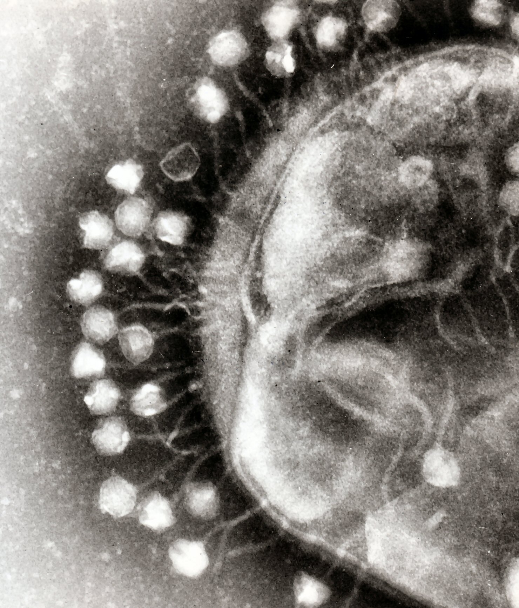
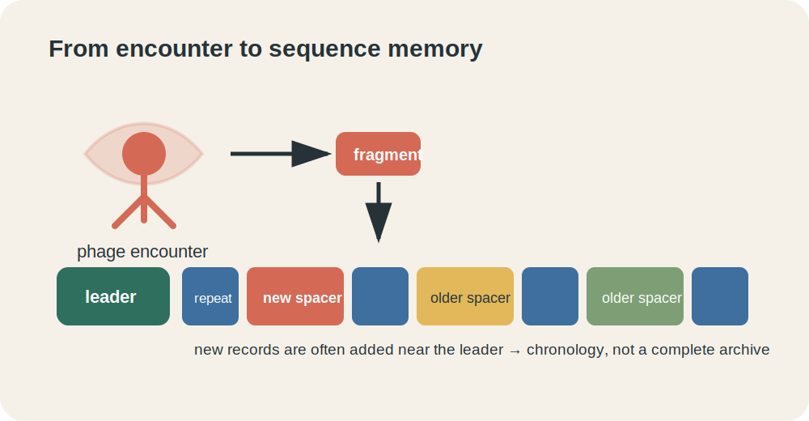
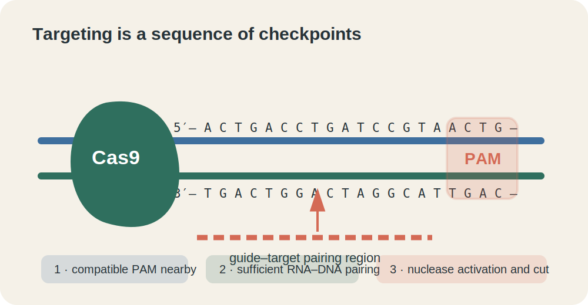
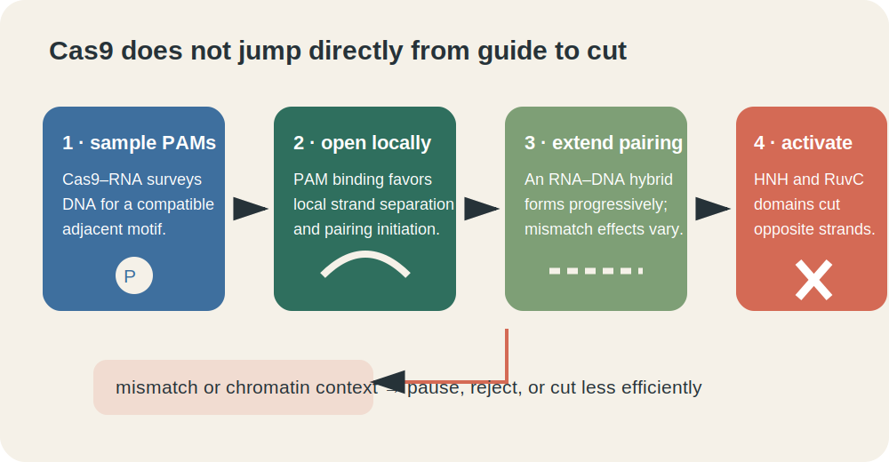

# Chapter 1: CRISPR as a Biological System—Memory, Targeting, and Cas9

:::warning
**Demonstration only:** This chapter shows what an AI agent can produce by following Coursewerk. It is not intended for direct use in actual teaching and has not been classroom- or subject-matter validated.
:::

:::info
**Reference:** Five-article, revision-bound English Wikipedia corpus; exact revisions in `metadata/SOURCE_RECORD.json`  
**Audience:** Introductory undergraduate biology and biotechnology learners  
**Package license:** CC BY-SA 4.0  
**Safety boundary:** Conceptual explanation only; no experimental or clinical protocol
:::

:::success
**Chapter Learning Objectives**

- **1.1a–b:** Distinguish a CRISPR array, a spacer, a protospacer, Cas proteins, and an engineered guide.
- **1.2a–b:** Trace adaptation, guide biogenesis, and interference as connected but separable stages.
- **1.3a–b:** Explain PAM-dependent Cas9 targeting as a sequence of molecular checkpoints.
- **1.4a–b:** Compare active Cas9, nickase, and dCas9 while preserving the diversity of CRISPR systems.
:::

## Chapter Logic

CRISPR began as a biological observation: unusual repeated sequences in microbial genomes. The useful explanation is not “bacteria have scissors.” It is an information-flow system. A fragment from an invader can enter a genomic array, the array can be expressed and processed into guides, and a guide-bearing effector can later recognize related nucleic acid. Cas9 is one effector in one part of a much larger CRISPR–Cas landscape.

{{mermaid
flowchart LR
  A[invading nucleic acid] --> B[spacer acquisition]
  B --> C[repeat-spacer array]
  C --> D[pre-crRNA]
  D --> E[mature guide RNA]
  E --> F[Cas effector complex]
  G[PAM and target context] --> H[interrogation]
  F --> H
  H --> I{checkpoints satisfied?}
  I -->|yes| J[interference]
  I -->|no or weak| K[release or reduced activity]
}}

**Visual description:** Invading nucleic acid can contribute a spacer to a repeat–spacer array. Transcription and processing produce guide RNAs that join Cas effectors. The complex interrogates targets; PAM and pairing checkpoints determine whether interference proceeds or activity is reduced.

:::warning
**Language boundary:** “Memory,” “search,” and “editing” are compact metaphors. Microbes do not intend an outcome. Molecular interactions, selection, and inheritance produce the behavior described by those words.
:::

## 1.1 From Phage Encounter to Sequence Record{{attrs[#blk-memory01]}}

:::success
**Learning Objectives**

- Identify the parts of a CRISPR locus and relate a spacer to a foreign protospacer.
- Explain why an array is a partial, evolving sequence record rather than a complete archive.
:::

Bacteriophages infect bacteria, and mobile genetic elements move DNA between cells. Many bacteria and archaea contain CRISPR arrays: short repeated sequences separated by variable **spacers**. Nearby **cas** genes encode proteins used in acquisition, processing, or interference. A sequence in an invader that corresponds to a spacer is called a **protospacer**.

*Figure 1.1. Bacteriophages attached to a bacterial cell wall. Professor Graham Beards, via Wikimedia Commons, CC BY-SA 3.0; used without modification.*

During **adaptation**, proteins including Cas1 and Cas2 can integrate a fragment derived from foreign nucleic acid as a new spacer. In many studied arrays, new spacers are preferentially added near a leader sequence. The array can therefore preserve some order of acquisition. But spacers can also be lost, duplicated, acquired with biases, or rendered ineffective when an invader changes. “Molecular memory” is useful only if we remember that it is incomplete and continually shaped by evolution.

*Figure 1.2. A CRISPR array as an evolving sequence record. Original schematic by Yu Wang for this package.*

**Visual alternative:** A phage fragment moves toward the leader end of an array. The array alternates blue repeats with differently colored spacers; the newest spacer sits nearest the leader, while older spacers extend away from it.

| Term | Location or role | Do not confuse it with |
|---|---|---|
| Repeat | Recurring sequence in the host array | A guide-specific target sequence |
| Spacer | Variable sequence stored between repeats | An entire viral genome |
| Protospacer | Corresponding sequence in foreign nucleic acid | The PAM beside it |
| Leader | Region associated with array expression and acquisition orientation | A Cas protein |
| cas gene | Encodes a CRISPR-associated protein | The CRISPR array itself |

:::: tabs
::: tab Problem
A newly isolated bacterium has an array `leader–R–S3–R–S2–R–S1–R`, where `R` is a repeat. A related strain lacks `S3`. Give one cautious interpretation and one reason the order is not a perfect infection diary.
:::
::: tab Solution
A cautious interpretation is that `S3` may be a more recent acquisition because it lies nearest the leader and is absent from the related strain. The claim remains provisional: arrays can lose or rearrange spacers, strains can have different histories, and acquisition is biased. Sequence order alone does not reconstruct every encounter.
:::
::::

**Self-check:**

- Why is a spacer evidence of sequence acquisition but not proof of current immunity?
- Which sequence is in the host array, and which is in the invader?
- How could phage mutation change the usefulness of an existing spacer?

## 1.2 From Array to Guide-Bearing Effector{{attrs[#blk-biogenesis02]}}

:::success
**Learning Objectives**

- Trace transcription and processing from a CRISPR array to a mature guide.
- Compare the natural Type II crRNA–tracrRNA arrangement with an engineered single-guide RNA.
:::

An array cannot recognize anything while it remains only DNA. It is transcribed into a longer precursor RNA, then processed into shorter **CRISPR RNAs (crRNAs)**. Each mature crRNA contains a spacer-derived region that can base-pair with a related target. Processing differs across CRISPR classes and types; no single diagram represents them all.

In a Type II system, a **trans-activating crRNA (tracrRNA)** pairs with repeat-derived portions of the CRISPR transcript and participates in crRNA maturation. The crRNA and tracrRNA then work with Cas9. Engineering joined important functional parts of those two RNAs into a **single-guide RNA (sgRNA)**. This simplification made retargeting convenient: the guide sequence can be changed without redesigning the entire protein.

{{mermaid
flowchart LR
  A[CRISPR array DNA] -->|transcription| B[pre-crRNA]
  C[tracrRNA] --> D[paired RNA intermediate]
  B --> D
  D -->|processing| E[mature crRNA + tracrRNA]
  E --> F[Cas9 guide complex]
  G[engineered fusion] --> H[single-guide RNA]
  H --> F
}}

**Visual description:** Array DNA is transcribed into pre-crRNA. In a Type II example, tracrRNA pairs with the precursor and processing creates a mature two-RNA guide. Engineering can fuse the guide functions into one sgRNA, which also forms a complex with Cas9.

The sgRNA is not “Cas9's GPS.” A GPS knows a global coordinate system; a guide participates in local molecular recognition. The complex still depends on target accessibility, an appropriate adjacent motif, pairing patterns, and conformational changes.

:::: tabs
::: tab Problem
An engineered sgRNA retains its Cas9-binding scaffold but its target-pairing segment is replaced. Which property is intentionally changed, and which property is intended to remain?
:::
::: tab Solution
The preferred DNA sequence is changed because the pairing segment is different. The ability to assemble with the same compatible Cas9 is intended to remain because the scaffold is retained. Actual activity still must be measured; sequence design alone is not proof of binding or cleavage.
:::
::::

**Self-check:**

- What information moves from a spacer into a mature guide?
- Why is the sgRNA an engineering simplification rather than the natural form in every organism?
- Which part of the system is commonly redesigned when a new target is chosen?

## 1.3 PAM Recognition, Pairing, and Cleavage{{attrs[#blk-targeting03]}}

:::success
**Learning Objectives**

- Explain why PAM context and guide complementarity are separate requirements.
- Model Cas9 recognition as progressive checkpoints with context-dependent mismatch effects.
:::

For the commonly used *Streptococcus pyogenes* Cas9, a target is typically considered beside a short PAM often written `5′-NGG-3′`, where `N` can be any base in that position. This is a specific example, not a universal CRISPR rule. Different Cas proteins recognize different motifs, and some CRISPR systems target RNA.

*Figure 1.3. PAM-dependent target recognition. Original schematic by Yu Wang.*

**Visual alternative:** Cas9 sits beside double-stranded DNA. A highlighted PAM is adjacent to, but outside, the guide-pairing region. Three labels show the sequence: compatible PAM, sufficient guide pairing, then nuclease activation.

Cas9 samples DNA for a compatible PAM, locally opens the duplex, and allows guide RNA to pair with one strand. Progressive pairing forms an RNA–DNA hybrid while the displaced DNA strand forms part of an R-loop. Structural changes position nuclease domains: HNH cuts the guide-complementary strand and RuvC cuts the other strand in the usual active-Cas9 model.

*Figure 1.4. Recognition as checkpoints rather than an exact string lookup. Original conceptual diagram by Yu Wang.*

**Visual alternative:** Four cards proceed from PAM sampling to local opening, progressive pairing, and activation. A branch from pairing shows that mismatches or context can cause rejection, delay, or weaker activity.

Mismatch effects depend on position, number, identity, guide and nuclease design, chromatin context, and assay. Therefore, neither “one mismatch prevents cutting” nor “Cas9 tolerates mismatches” is a complete predictive rule. Specificity is empirical and conditional.

:::: tabs
::: tab Problem
Candidate A perfectly matches the guide but lacks a compatible PAM. Candidate B has a compatible PAM and one guide–DNA mismatch. Which candidate is guaranteed to be cut?
:::
::: tab Solution
Neither is guaranteed. Candidate A is generally not expected to support ordinary SpCas9 recognition without a compatible PAM. Candidate B passes the PAM checkpoint, but the mismatch may or may not prevent later steps depending on context. The correct conclusion is a testable prediction, not certainty.
:::
::::

**Self-check:**

- Is the PAM copied into the guide RNA?
- Why can two targets with similar sequence identity show different activity?
- Which observation would distinguish binding from cleavage?

## 1.4 One Platform, Several Molecular Actions{{attrs[#blk-variants04]}}

:::success
**Learning Objectives**

- Compare nuclease-active Cas9, nickase variants, and dCas9.
- Explain why Cas9 is a useful example without treating it as the whole CRISPR field.
:::

Changing catalytic domains can separate targeting from cutting. **Wild-type nuclease-active Cas9** usually creates a double-strand break at a suitably recognized target. A **nickase** disables one cutting activity and creates a single-strand break under the relevant design. **Catalytically inactive Cas9 (dCas9)** retains programmable binding but lacks the usual cleavage activity; it can obstruct transcription or carry attached regulatory domains to a target.

| Platform | Target recognition | Typical direct molecular action | Example conceptual use |
|---|---|---|---|
| Active Cas9 | Guide + PAM dependent | Double-strand cleavage | Create a lesion repaired by the cell |
| Cas9 nickase | Guide + PAM dependent | Single-strand nick | Paired-nick or editing architectures |
| dCas9 | Guide + PAM dependent | Binding without ordinary cleavage | Repress, activate, label, or recruit |

The phrase “CRISPR technology” also covers other effectors and chemistries. Cas12 and Cas13 systems have different substrate preferences and properties; base and prime editors attach new catalytic functions to targeting platforms; CRISPR interference changes expression without rewriting the target sequence. The stable lesson is modularity: recognition, catalytic action, delivery, and cellular response can be varied separately, but every combination requires validation.

:::: tabs
::: tab Problem
A study reports lower expression of a gene after targeting its promoter with dCas9, but target-locus sequencing shows no sequence change. Is that internally contradictory?
:::
::: tab Solution
No. dCas9 can bind without cutting and can obstruct transcription or recruit regulatory domains. A change in expression without a DNA-sequence edit is compatible with transcriptional regulation. Controls are still needed to show that the effect is target-dependent.
:::
::::

**Self-check:**

- Which function is preserved in dCas9, and which is removed?
- Why does a binding assay not establish nuclease activity?
- Give one reason a Cas9-centered diagram cannot represent all CRISPR systems.

## Synthesis

CRISPR–Cas systems connect inherited sequence records to guide-directed recognition. In a Type II Cas9 example, adaptation can add spacers, transcription and processing generate guide RNAs, and a guide-bearing Cas9 complex interrogates PAM-adjacent DNA through multiple checkpoints. Engineering an sgRNA makes target preference programmable, while nuclease, nickase, and dCas9 variants separate recognition from different actions. Chapter 2 follows what happens after an engineered system enters a cell: delivery, repair, outcome heterogeneity, validation, and decisions.

## Asset and License Record for This Chapter

| Asset | Source | License | Attribution |
|---|---|---|---|
| `bacteriophages.jpg` | [Wikimedia Commons](https://commons.wikimedia.org/wiki/File:Phage.jpg) | CC BY-SA 3.0 | Professor Graham Beards; unchanged |
| `crispr-locus-memory.svg` | Original for this package | CC BY-SA 4.0 | Yu Wang |
| `targeting-pam.svg` | Original for this package | CC BY-SA 4.0 | Yu Wang |
| `cas9-checkpoints.svg` | Original for this package | CC BY-SA 4.0 | Yu Wang |

**Text adaptation:** Adapted and reorganized from [CRISPR](https://en.wikipedia.org/wiki/CRISPR), [Cas9](https://en.wikipedia.org/wiki/Cas9), and [CRISPR gene editing](https://en.wikipedia.org/wiki/CRISPR_gene_editing) by Wikipedia contributors, CC BY-SA 4.0. Exact revisions are recorded in `metadata/SOURCE_RECORD.json`.
